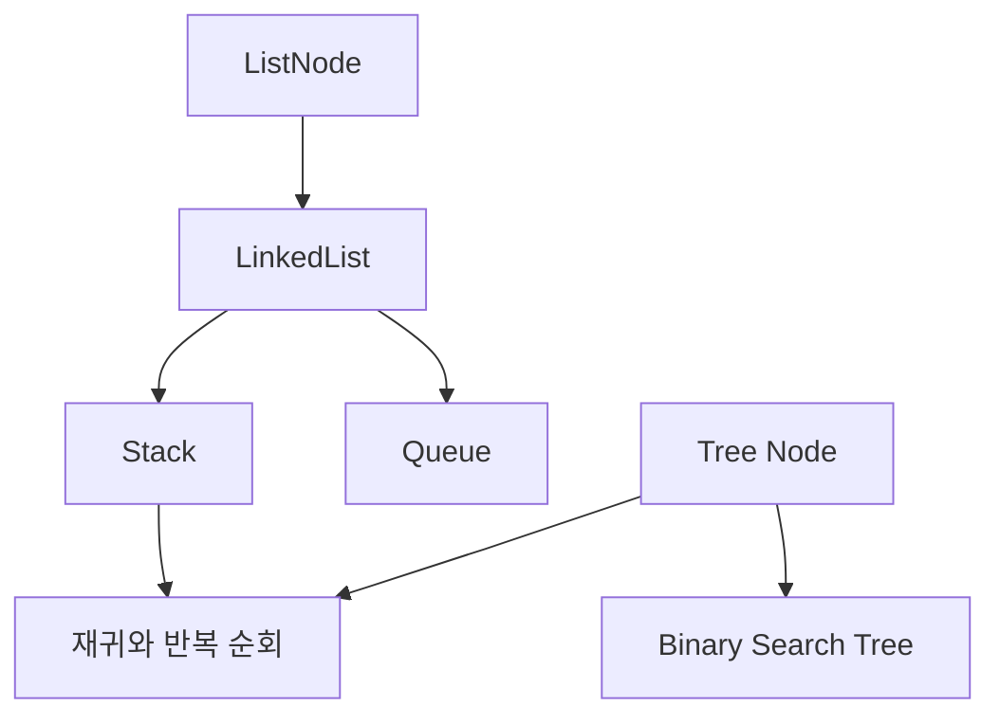

# CDataStructures

연결 리스트부터 binary search tree까지 기본 자료구조를 C로 직접 구현한 개인 학습 저장소입니다. 각 문제는 독립된 실행 파일이며 DevContainer에서 compile하고 debugger로 pointer 변화를 확인할 수 있습니다.

## 시작한 이유

자료구조를 Python container 사용법으로만 익히지 않고, node 할당과 해제, link 변경, stack과 queue의 상태를 memory 수준에서 이해하려고 시작했습니다. 크래프톤 정글 자료구조 과제를 주제별로 정리했습니다.

## 구현 범위

| 주제 | 구현 내용 |
| --- | --- |
| Linked List | 삽입, 삭제, 정렬 삽입, 병합과 변형 |
| Stack과 Queue | push, pop, enqueue, dequeue, 재귀 응용 |
| Binary Tree | 생성, 순회, 구조 비교, 높이와 node 계산 |
| Binary Search Tree | 삽입, 탐색, 순회와 tree 변형 |

## 아키텍처와 코드 구조



| 경로 | 내용 |
| --- | --- |
| `Data-Structures/Linked_List/` | 단일 연결 리스트 문제 |
| `Data-Structures/Stack_and_Queue/` | linked list 기반 stack과 queue |
| `Data-Structures/Binary_Tree/` | 일반 binary tree 문제 |
| `Data-Structures/Binary_Search_Tree/` | BST 탐색과 순회 문제 |

## 문제 해결 과정

### Queue 동작을 linked list 연산으로 통일

Queue마다 node 연결 코드를 다시 작성하면 head와 size 갱신 규칙이 달라질 수 있습니다. Queue가 `LinkedList`를 포함하게 만들고 enqueue는 마지막 index 삽입, dequeue는 첫 node 삭제를 사용하도록 연결했습니다.

empty queue에서는 head를 읽지 않고 먼저 size를 확인합니다. 모든 node를 비울 때도 최초 size만큼 dequeue해 하나의 삭제 경로를 재사용했습니다.

### 재귀 호출 순서로 queue 뒤집기

앞에서 꺼낸 값을 바로 넣으면 순서가 달라지지 않습니다. 한 값을 dequeue한 뒤 남은 queue를 먼저 뒤집고, 호출이 돌아오는 순서에 맞춰 값을 enqueue했습니다.

마지막 값부터 다시 들어가므로 별도의 배열이나 두 번째 queue 없이 기존 queue를 역순으로 만들 수 있습니다. empty 상태를 재귀 종료 조건으로 사용했습니다.

### 두 tree의 구조와 값을 함께 비교

두 node가 모두 NULL이면 같은 끝점이고 한쪽만 NULL이면 구조가 다릅니다. 두 node가 존재할 때는 현재 값과 왼쪽 subtree, 오른쪽 subtree가 모두 같을 때만 동일한 tree로 판단했습니다.

tree 해제도 같은 재귀 구조를 사용하되 자식을 먼저 해제하고 현재 node를 마지막에 free했습니다. 해제한 root pointer는 NULL로 바꿔 다시 접근하지 않게 했습니다.

### 반복 post-order에서 오른쪽 subtree 보류

post-order는 왼쪽, 오른쪽, root 순서라 stack 하나만 사용하면 오른쪽 subtree 방문 시점을 잃기 쉽습니다. 주 stack에는 탐색 경로를, 보조 stack에는 나중에 방문할 오른쪽 child를 저장했습니다.

현재 node의 오른쪽 child가 보조 stack top과 같으면 오른쪽으로 이동하고, 아니면 현재 node를 출력해 재귀 없이 순서를 유지했습니다.

## 실행 방법

VS Code에서 저장소를 연 뒤 Dev Containers의 `Reopen in Container`를 선택합니다. 각 문제는 독립된 C file이므로 다음처럼 compile합니다.

```bash
gcc -std=c11 -Wall -Wextra \
  Data-Structures/Stack_and_Queue/Q5_C_SQ.c \
  -o /tmp/queue_reverse
/tmp/queue_reverse
```

## 테스트

27개 C source를 GCC 14에서 각각 compile해 기본 build 가능 여부를 확인했습니다.

```bash
find Data-Structures -name '*.c' -print | while IFS= read -r file; do
  gcc -std=c11 -Wall -Wextra "$file" -o /tmp/ds-check
done
```

## 남은 과제

- `Q5_F_BST.c`의 BST node 삭제 구현
- 반환값이 빠진 함수와 compiler warning 정리
- interactive input과 분리된 자동 test runner 추가

## 관련 프로젝트

- [Algorithms](https://github.com/NearthYou/Algorithms): graph, search, dynamic programming을 Python 문제로 확장한 학습 기록
- [MemoryAllocator](https://github.com/NearthYou/MemoryAllocator): C pointer와 block metadata를 이용한 동적 할당기
